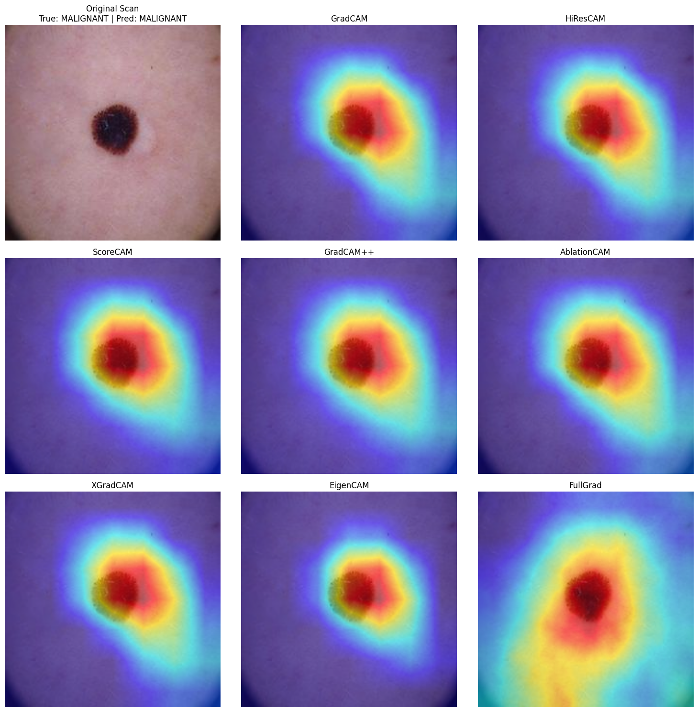

# Deep Learning Drift Visualization

This repository contains a comprehensive Jupyter Notebook and an interactive Streamlit dashboard demonstrating how to detect and visualize model performance issues (such as data drift) and interpret model decisions using Class Activation Mapping (CAM) techniques.

## Project Overview

When deploying machine learning models, especially deep learning models, they may encounter data that differs from their training distribution (data drift). This notebook provides a complete pipeline to:
1. **Train** a baseline Convolutional Neural Network (`SimpleCNN`) on the **MNIST** dataset.
2. **Evaluate** the model on a different, but somewhat related, distribution (**SVHN** - Street View House Numbers dataset) to simulate data drift or out-of-distribution (OOD) data.
3. **Visualize** the model's focus and attention using 8 different Grad-CAM algorithms to understand *why* the model makes specific predictions and how data drift affects its reasoning.

## Key Components

- **Data Pipeline:**
  - Loads the MNIST dataset for training.
  - Applies transformations (resizing to 32x32, converting grayscale to 3-channel RGB) to match SVHN requirements.
  - Loads the SVHN dataset for testing and drift evaluation.
- **Model Architecture:**
  - `SimpleCNN`: A custom CNN architecture consisting of two convolutional layers with ReLU activation and Max-Pooling, followed by two fully connected layers.
- **Training & Evaluation:**
  - Implements a standard PyTorch training loop.
  - Uses CrossEntropyLoss and the Adam optimizer.
  - Visualizes Loss and Accuracy metrics using Matplotlib.
- **Interpretability & Visualization:**
  - Integrates the `grad-cam` library to generate heatmaps.
  - Compares 8 state-of-the-art CAM algorithms:
    1. **GradCAM**: Uses the gradients of the target concept flowing into the final convolutional layer to produce a coarse localization map highlighting important regions in the image.
    2. **HiResCAM**: Similar to GradCAM but calculates the weights differently, preserving higher resolution spatial details and preventing cross-talk between different features.
    3. **ScoreCAM**: A gradient-free visual explanation method that uses the increase in confidence score when passing a mask multiplied with the input image to determine weight, making it less noisy.
    4. **GradCAM++**: An extension of GradCAM that uses second-order gradients to provide better localization of objects, especially when there are multiple occurrences of the same class in an image.
    5. **AblationCAM**: A gradient-free method that systematically ablates (zeroes out) individual feature map channels to measure their impact on the final prediction, often resulting in cleaner heatmaps.
    6. **XGradCAM**: An improvement over GradCAM that seeks to achieve better theoretical grounding and faithfulness to the model by adjusting the gradient weights using normalized feature maps.
    7. **EigenCAM**: Computes the principal components (eigenvectors) of the feature maps, focusing on the most dominant patterns learned by the network without relying on class-specific gradients or backpropagation.
    8. **FullGrad**: Aggregates the gradients of the biases from all convolutional layers in addition to the input image gradients, capturing both local and global importance across the entire network.
  - Outputs a 3x3 grid visualizing how each algorithm interprets the model's focus on the input image.

## Example on Cancer Datasets

To demonstrate that the drift visualization and CAM techniques are widely applicable across different domains, here is an example of the methodology applied to a cancer-based dataset (e.g., Melanoma detection):



This proves the utility of these interpretability methods beyond simple datasets (like MNIST/SVHN) and highlights their effectiveness on complex medical imaging tasks.

## Interactive Web Dashboard (app.py)

In addition to the notebook, this repository features a professional **Streamlit Dashboard** (`app.py`) for real-time inference and interpretability on melanoma (skin cancer) datasets. 

**Features:**
- **Upload & Analyze**: Users can upload a skin lesion image (JPEG, PNG, etc.) and get an instant diagnosis (Benign/Malignant) using a fine-tuned ResNet-18 model.
- **Real-time CAM Visualization**: Interactively select from 8 CAM algorithms (GradCAM, ScoreCAM, EigenCAM, etc.) to see a heatmap overlay on the uploaded image.
- **Confidence Metrics**: View clear probability scores for each class.
- **Export Results**: Download the generated CAM overlays, raw heatmaps, or side-by-side comparison images.

## Requirements

The dependencies for both the notebook and the Streamlit app are listed in `requirements.txt`. Key libraries include:
- `torch`
- `torchvision`
- `matplotlib`
- `numpy`
- `grad-cam`
- `streamlit`
- `Pillow`

Install them using:
```bash
pip install -r requirements.txt
```

## Usage

### 1. Jupyter Notebook
1. Clone this repository.
2. Open `DeepLearning_Drift_Visualization.ipynb` in Jupyter Notebook, JupyterLab, or Google Colab.
3. Run the cells sequentially to load data, train the model, and generate the visualizations.

### 2. Streamlit Dashboard
1. Ensure the `melanoma_resnet18.pth` model weights are in the same directory.
2. Run the dashboard using:
```bash
streamlit run app.py
```
3. Open the provided local URL in your browser to interact with the melanoma analyzer.
